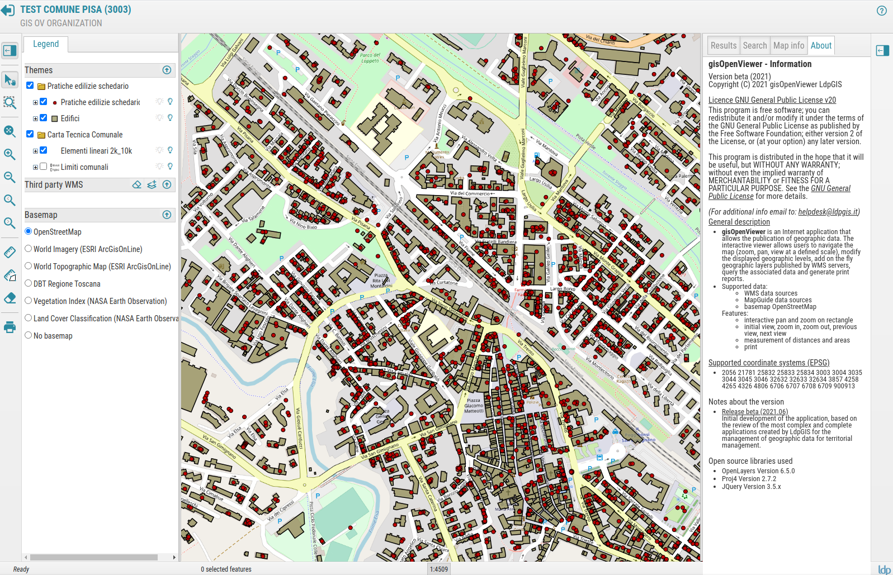

<!--
*** Thanks for checking out the Best-README-Template. If you have a suggestion
*** that would make this better, please fork the repo and create a pull request
*** or simply open an issue with the tag "enhancement".
*** Thanks again! Now go create something AMAZING! :D
***
***
***
*** To avoid retyping too much info. Do a search and replace for the following:
*** github_username     > ldp-progetti-gis
*** repo_name           > ldp-viewer
*** twitter_handle      > 
*** email               > helpdesk@ldpgis.it
*** project_title       > gisOpenViewer
*** project_description >
-->


<!-- PROJECT SHIELDS -->
<!--
*** I'm using markdown "reference style" links for readability.
*** Reference links are enclosed in brackets [ ] instead of parentheses ( ).
*** See the bottom of this document for the declaration of the reference variables
*** for contributors-url, forks-url, etc. This is an optional, concise syntax you may use.
*** https://www.markdownguide.org/basic-syntax/#reference-style-links
-->
[![Contributors][contributors-shield]][contributors-url]
[![Forks][forks-shield]][forks-url]
[![Stargazers][stars-shield]][stars-url]
[![Issues][issues-shield]][issues-url]
[![MIT License][license-shield]][license-url]
[![LinkedIn][linkedin-shield]][linkedin-url]


<!-- PROJECT LOGO -->
<p align="center">
  <a href="https://github.com/ldp-progetti-gis/ldp-viewer">
    
  </a>

  <h3 align="center">gisOpenViewer</h3>

  <p align="center">
    Display spatial data and handle map navigation, querying attriute and on the fly adding of additional layers from online data sources
    <br />
    <a href="https://github.com/ldp-progetti-gis/ldp-viewer"><strong>Explore the docs »</strong></a>
    <br />
    <br />
    <a href="https://github.com/ldp-progetti-gis/ldp-viewer">View Demo</a>
    ·
    <a href="https://github.com/ldp-progetti-gis/ldp-viewer/issues">Report Bug</a>
    ·
    <a href="https://github.com/ldp-progetti-gis/ldp-viewer/issues">Request Feature</a>
  </p>
</p>


<!-- TABLE OF CONTENTS -->
<details open="open">
  <summary><h2 style="display: inline-block">Table of Contents</h2></summary>
  <ol>
    <li>
      <a href="#about-the-project">About The Project</a>
      <ul>
        <li><a href="#built-with">Built With</a></li>
      </ul>
    </li>
    <li>
      <a href="#getting-started">Getting Started</a>
      <ul>
        <li><a href="#prerequisites">Prerequisites</a></li>
        <li><a href="#installation">Installation</a></li>
        <li><a href="#customization">Customization</a></li>
        <li><a href="#make-it-working">Make it working</a></li>
      </ul>
    </li>
    <li><a href="#roadmap">Roadmap</a></li>
    <li><a href="#contributing">Contributing</a></li>
    <li><a href="#license">License</a></li>
    <li><a href="#contact">Contact</a></li>
    <li><a href="#acknowledgements">Acknowledgements</a></li>
  </ol>
</details>


<!-- ABOUT THE PROJECT -->
## About The Project

[](https://www.ldpgis.it/)

gisOpenViewer is an Internet application that allows the publication of geographic data. The interactive viewer
allows users to navigate the map (zoom, pan, view at a defined scale), modify the displayed geographic levels,
add on the fly geographic layers published by WMS servers, query the associated data.


### Built With

* [OpenLayers](https://openlayers.org)
* [Proj4](https://proj.org)
* [JQuery](https://jquery.com)
* [Bootstrap](https://getbootstrap.com)


<!-- GETTING STARTED -->
## Getting Started

To get a local copy up and running follow these simple steps.

### Prerequisites

The application has no prerequisites.

It was developed using PHP and JavaScript, and for almost all used libraries (listed above) there is a local copy of the related code (with the exception of few exceptions where there is a link to an online resource).

### Installation

Clone the repo in your folder
   ```sh
   git clone https://github.com/ldp-progetti-gis/ldp-viewer.git
   ```
### Customization

1. Configure the php/etc/config.inc.php file<br>
   This file includes the general definitions common to all scripts. This file is very general, and it is not
   "directly" included inside the script, but it is referenced (included) by other more specific configuration
   files, focused on specific applications (config.app.inc.php).
   
   In this file it is possible to customize:
   - name and links to the organization
   - name of the application
   - version and date
   - other "service" variables
   
2. Configure the php/etc/config.app.inc.php file<br>
   This file includes the specific definitions common to all scripts. This file extends the general configuration
   file "config.inc.php" (this script is included).<br>
   The main sections of this configuration file relate to:<br>
   - configuration of the interface
   - configuration of the map options (projection, initial view, map units, etc.)
   - definition of the **main layers** (representing the main contents of the application/map)<br>
     Usually this layers derive from a WMS server.<br>
     The definition of the list of the layers can be done by setting a set of variables for each layers, 
     and the sub-layers can be grouped using a two levels structure (groups and layers).<br>
     Below an example of the code:
   ```sh
	$GLOBALS[$GLOBALS['package']]['map_definition']= array(
			'wms_geoserver'=> array(
					'tipo'=> 'wms_geoserver',
					'url' => 'https://sit.spid.comune.poggibonsi.si.it/services/wms',
					'layers_info'=> array(
							'view_pratiche_punti'=> array(
									'min_scale'=> 1,
									'max_scale'=> 50000,
									'tooltip'=> 'Pratica n. %numero_pratica%',
									'hyperlink'=> 'ricerca_info_pratica_edilizia.php?id=%ogc_fid%',
									'selectable'=> true,
									'visible'=> true,
									'legend_label'=> 'Pratiche edilizie schedario',
									'image_legend_layer'=> 'view_pratiche_punti',
									'feature_name'=> 'view_pratiche_punti',
									'group'=> 'pratiche_edilizie'
							),
							'edifici'=> array(
									'min_scale'=> 1,
									'max_scale'=> 10000,
									'tooltip'=> 'Edificio %id%',
									'hyperlink'=> 'extra_info/info_edifici.php?id=%id%',
									'selectable'=> true,
									'visible'=> true,
									'legend_label'=> 'Edifici',
									'image_legend_layer'=> 'edifici',
									'feature_name'=> 'edifici',
									'group'=> 'pratiche_edilizie'
							),
							'elementi_lineari_2k_10k'=> array(
									'min_scale'=> 1,
									'max_scale'=> 5000,
									'tooltip'=> '%topon%',
									'hyperlink'=> '',
									'selectable'=> true,
									'visible'=> true,
									'legend_label'=> 'Elementi lineari 2k_10k',
									'image_legend_layer'=> 'elementi_lineari_2k_10k',
									'feature_name'=> 'elementi_lineari_2k_10k',
									'group'=> 'ctc'
							),
							'limiti_amministrativi'=> array(
									'min_scale'=> 500,
									'max_scale'=> 50000,
									'tooltip'=> '%nome%',
									'hyperlink'=> '',
									'selectable'=> false,
									'visible'=> false,
									'legend_label'=> 'Limiti comunali',
									'image_legend_layer'=> 'limiti_amministrativi',
									'feature_name'=> 'limiti_amministrativi',
									'group'=> 'ctc'
							)
					),
					'groups_info'=> array(
							'pratiche_edilizie'=> array(
									'visible'=> true,
									'legend_label'=> 'Pratiche edilizie schedario',
									'expanded'=> true
							),
							'ctc'=> array(
									'visible'=> true,
									'legend_label'=> 'Carta Tecnica Comunale',
									'expanded'=> true
							)
					)
			)
	);
   ```
   - definition of the **basemaps**<br>
     These layers are used as background and reference for the overlapped layers.<br>
     It is not possible to show more than one basemap at the time.<br>
     The definition of the basemaps is similar to the main layers. Below a sample code:
   ```sh
	$GLOBALS[$GLOBALS['package']]['basemap_layers_definition']=array(
		'open_street_map' => array(	//open_street_map
			'source_type' => 'OSM',  
			'wms_url' => null,
			'wms_layers_names' => null,
			'wms_query_layers_names' => '',
			'wms_info_format' => '',
			'wms_server_type' => null,
			'wms_layer_projection' => 'EPSG:4326',
			'layer_title' => 'OpenStreetMap',
			'layer_visible' => ($GLOBALS[$GLOBALS['package']]['map_options']['default_base_layer'] == 'open_street_map'),
			'is_basemap_layer' => true
		),
		'no_basemap' => array(
			'source_type' => '',
			'wms_url' => '',
			'wms_layers_names' => '',
			'wms_query_layers_names' => '',
			'wms_info_format' => '',
			'wms_server_type' => '',
			'wms_layer_projection' => '',
			'layer_title' => $GLOBALS['strings']['interface']['sentence_nobasemap'],
			'layer_visible' => ($GLOBALS[$GLOBALS['package']]['map_options']['default_base_layer'] == 'no_basemap'),
			'is_basemap_layer' => true
		)
	);   
   ```
   - definition of the **predefined external WMS server**<br>
     The predefined WMS servers are listed in the "add WMS layer" window and make easier the selection of the layers to be added on the fly.<br>
     In any case, the user can type directly the url of her/his preferred WMS source, even if this source is not present as predefined.<br>
     Below a sample code:
   ```sh
	$GLOBALS[$GLOBALS['package']]['wms_server'] = array(
		"neo_nasa"=> array(
			"title"			=> "NASA Earth Observation",
			"description_url"	=> "https://neo.sci.gsfc.nasa.gov/",
			"server_url"		=> "https://neo.sci.gsfc.nasa.gov/wms/wms?version=1.3.0&service=WMS"
		),
		"corine_2018"=> array(
			"title"			=> "Corine Land Cover 2018",
			"description_url"	=> "https://copernicus.discomap.eea.europa.eu/arcgis/rest/services/Corine/CLC2018_WM/MapServer",
			"server_url"		=> "https://copernicus.discomap.eea.europa.eu/arcgis/services/Corine/CLC2018_WM/MapServer/WMSServer"
		)
	);
   
   ```
     
   - definition of additional "service" parameter


### Make it working

You may decide to publish the application using your own infrastructure and following your own habit.

As an alternative, in the git folder there is a "docker" configuration file which allows to publish the application directly from your local computer.

[Docker](https://www.docker.com/) is an open platform for developing, shipping, and running applications. Docker enables you to separate your applications from your infrastructure so you can deliver software quickly. With Docker, you can manage your infrastructure in the same ways you manage your applications. By taking advantage of Docker’s methodologies for shipping, testing, and deploying code quickly, you can significantly reduce the delay between writing code and running it in production.

Below an example of Docker configuration file to start a php server named "php73" on the port 7000:80

   ```sh
    version: '3.3'
    services:
            web:
                    build:
                            context: ./php
                            dockerfile: Dockerfile
                    container_name: php73
                    volumes:
                            - ./php:/var/www/html/
                    ports:
                            - 7000:80
   ```
To launch the server you must run from the console:
```sh
	sudo docker-compose.yml up
	... and type the password of the "sudo"
```

<!-- ROADMAP -->
## Roadmap

See the [open issues](https://github.com/ldp-progetti-gis/ldp-viewer/issues) for a list of proposed features (and known issues).


<!-- CONTRIBUTING -->
## Contributing

Contributions are what make the open source community such an amazing place to be learn, inspire, and create. Any contributions you make are **greatly appreciated**.

1. Fork the Project
2. Create your Feature Branch (`git checkout -b feature/AmazingFeature`)
3. Commit your Changes (`git commit -m 'Add some AmazingFeature'`)
4. Push to the Branch (`git push origin feature/AmazingFeature`)
5. Open a Pull Request


<!-- LICENSE -->
## License

Distributed under the GNU GENERAL PUBLIC LICENSE, Version 2 License. See `LICENSE` for more information.


<!-- CONTACT -->
## Contact

LDP Progetti GIS - [@twitter_handle](https://twitter.com/twitter_handle) - helpdesk@ldpgis.it

Project Link: [https://github.com/ldp-progetti-gis/ldp-viewer](https://github.com/ldp-progetti-gis/ldp-viewer)


<!-- MARKDOWN LINKS & IMAGES -->
<!-- https://www.markdownguide.org/basic-syntax/#reference-style-links -->
[contributors-shield]: https://img.shields.io/github/contributors/ldp-progetti-gis/repo.svg?style=for-the-badge
[contributors-url]: https://github.com/ldp-progetti-gis/repo/graphs/contributors
[forks-shield]: https://img.shields.io/github/forks/ldp-progetti-gis/repo.svg?style=for-the-badge
[forks-url]: https://github.com/ldp-progetti-gis/repo/network/members
[stars-shield]: https://img.shields.io/github/stars/ldp-progetti-gis/repo.svg?style=for-the-badge
[stars-url]: https://github.com/ldp-progetti-gis/repo/stargazers

[issues-shield]: https://img.shields.io/github/issues/ldp-progetti-gis/repo.svg?style=for-the-badge
[issues-url]: https://github.com/ldp-progetti-gis/ldp-viewer/issues

[license-shield]: https://img.shields.io/github/license/ldp-progetti-gis/repo.svg?style=for-the-badge
[license-url]: https://github.com/ldp-progetti-gis/ldp-viewer/blob/main/LICENSE.txt

[linkedin-shield]: https://img.shields.io/badge/-LinkedIn-black.svg?style=for-the-badge&logo=linkedin&colorB=555
[linkedin-url]: https://it.linkedin.com/company/ldp-progetti-gis

